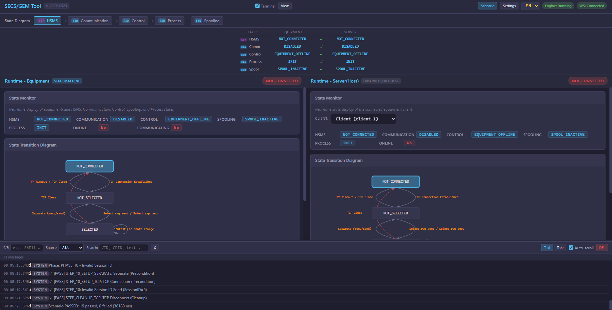

# OCA GEM Tool

**SECS/GEM Communication Simulator & Testing Tool**

A browser-based interactive tool for simulating, testing, and visualizing SEMI SECS/GEM semiconductor equipment communication protocols. Runs as a single standalone executable — no Node.js required.

---

## 🎥 Demo Video

[![oca gem tool Demo][(https://img.youtube.com/vi/dVsGrhBqZTw/maxresdefault.jpg)](https://youtu.be/dVsGrhBqZTw)](https://youtu.be/HYRkj6xudXE)

---

## 🎯 Motivation & Background

At its core, SECS/GEM communication is simply a matter of managing state transitions and string-based data exchanges. However, due to varying interpretations of the SEMI standards and their inherent vastness, engineers are often forced into overly complex implementations.

Spending excessive time and implementation costs just to build these fundamentally simple structures is a root cause of stagnation in the manufacturing automation industry. 

The primary goal of this project is the **democratization of SECS/GEM**. By opening up this traditionally closed and complicated domain, we aim to free engineers from endless communication debugging, allowing them to focus on what truly matters: the core machine control logic.

---

## ✨ Features

### 🔌 HSMS/SECS-II Protocol (SEMI E37)
- **Active (Equipment) + Passive (Host)** HSMS TCP connections
- Select / Deselect / Linktest / Separate control messages
- SECS-II message encoding/decoding with real-time hex & structured view
- Auto-respond for common messages (S1F1, S1F13, S6F11, Select.req)

### 📊 GEM State Machine Visualization (SEMI E30)
- **5-layer state machine** with interactive SVG diagrams:
  - **HSMS** — TCP connection & session management
  - **Communication** — Establish Communication (S1F13/S1F14)
  - **Control** — Equipment Online/Offline/Local/Remote
  - **Process** — Processing state lifecycle (INIT → SETUP → READY → EXECUTING → ...)
  - **Spooling** — Message spooling management
- Layer dependency bar showing the HSMS → Communication → Control → Process → Spooling cascade
- **State Sync Matrix** — real-time Equipment vs Host state comparison per layer

### 🖥️ Dual-Panel Architecture
| Equipment (Left) | Host / Server (Right) |
|---|---|
| State Machine owner (Active HSMS) | Observer / Request side (Passive HSMS) |
| GEM Equipment simulation | GEM Host simulation |
| Event triggering, Alarm reports | S2F33/S2F35/S2F37/S2F41 commands |
| Manual state transitions | Manual state transitions |

### 🧪 Scenario Runner
- Load and execute JSON-based test scenarios
- Automated state machine verification per step
- Phase-based execution with PASS/FAIL per step
- Built-in scenarios:
  - **GEM-NORMAL-001** — Normal communication establishment & processing flow
  - **GEM-HSMS-ERROR-001** — Error handling (connection loss, timeout, reject)
- Supports both English and Japanese scenario files
- Custom scenario upload via UI

### ⚙️ GEM Configurator
- Define **Variables** (VID) with SECS-II data types (U1–U4, I1–I4, ASCII, Boolean, etc.)
- Define **Reports** (RPTID) — group variables into report structures
- Define **Events** (CEID) — link events to reports
- JSON Import / Export
- Push configuration to running engine in real-time

### 🌐 Internationalization (i18n)
- English / Japanese UI switching
- All labels, messages, and tooltips are translatable

### 📟 Terminal / Message Log
- Real-time SECS-II message log with timestamps
- Send/Receive direction indicators
- Raw hex display for protocol debugging

---

## 📦 Requirements

To use this tool, you need the following software installed on your system:
- **Python**
- **Microsoft Visual C++ Redistributable**

---

## 🚀 Quick Start

### 1. Download

Download the latest release ZIP from the [Releases](../../releases) page.

### 2. Extract & Launch

```text
oca_gem_tool_vX.XXXX.XXXX/
├── launch.bat                  ← Double-click to start
├── oca_gem_tool_engine.exe     ← C++ standalone engine
├── index.html                  ← Web UI
├── css/
├── js/
├── scenarios/                  ← Built-in test scenarios
├── sample/                     ← Sample GEM configuration
└── version.txt

```

```bat
# Double-click launch.bat, or run from command line:
oca_gem_tool_engine.exe --port 8420

```

The browser opens automatically at `http://localhost:8420/`.

### 3. Connect

1. **Start Host (Server)**: In the right panel, configure IP/Port and click "Start Server" to begin listening (Passive HSMS)
2. **Connect Equipment (Client)**: In the left panel, set the target host/port and click "Connect" (Active HSMS)
3. **Establish Communication**: Send Select.req → S1F13 to establish SECS/GEM communication
4. **Observe State Transitions**: Watch the state diagrams and sync matrix update in real-time

---

## 📖 Usage


### Operation Modes

| Mode | Description |
| --- | --- |
| `standalone` (default) | Built-in HTTP + WebSocket server. Browser connects directly. |
| `stdio` | stdin/stdout JSON protocol. For integration with external systems. |

### Standalone Mode Architecture

```text
Browser ←→ HTTP  (port 8420) ←→ oca_gem_tool_engine.exe (static file server)
Browser ←→ WS    (port 8421) ←→ oca_gem_tool_engine.exe (commands & events)
                                         |
                              HsmsSession (TCP) ←→ GEM Equipment / Host

```


## ⚙️ GEM Configuration Format

The tool uses a JSON format for GEM variable/report/event definitions. See `sample/gem_config.json`:

```json
{
  "EquipmentModel": "MyEquipment",
  "Variables": [
    { "VID": 1001, "Name": "LotId",   "OcaTag": "Lot.Id",   "Type": "ASCII" },
    { "VID": 1002, "Name": "WaferNo", "OcaTag": "Wafer.No", "Type": "U4" }
  ],
  "Reports": [
    { "RPTID": 101, "VIDs": [1001, 1002] }
  ],
  "Events": [
    { "CEID": 5001, "Name": "ProcessStart", "LinkedRPTIDs": [101], "Enabled": true }
  ]
}

```

### Supported SECS-II Data Types

| Type | Description |
| --- | --- |
| `U1`, `U2`, `U4`, `U8` | Unsigned integer (1/2/4/8 bytes) |
| `I1`, `I2`, `I4`, `I8` | Signed integer (1/2/4/8 bytes) |
| `F4`, `F8` | Floating point (4/8 bytes) |
| `ASCII` | ASCII string |
| `Binary` | Raw binary data |
| `Boolean` | Boolean value |


---

## 📚 SEMI Standards Reference

| Standard | Coverage |
| --- | --- |
| **SEMI E37** (HSMS) | TCP transport, Select/Deselect/Linktest/Separate, Session management |
| **SEMI E5** (SECS-II) | Message encoding/decoding, Stream/Function, Data items |
| **SEMI E30** (GEM) | Communication, Control, Process, Spooling state machines |


---

## 📄 License & Proprietary Notice

⚠️ **License & Proprietary Notice**

Copyright (c) 2016-2026 Satoshi Murakami. All Rights Reserved.

This source code and related documentation are the **proprietary property** of Satoshi Murakami. Unauthorized copying, distribution, modification, or use of this file, via any medium, is strictly prohibited.

**Asset Acquisition:** For inquiries regarding technology transfer or IP acquisition, please contact the author directly.

Strictly Confidential.

